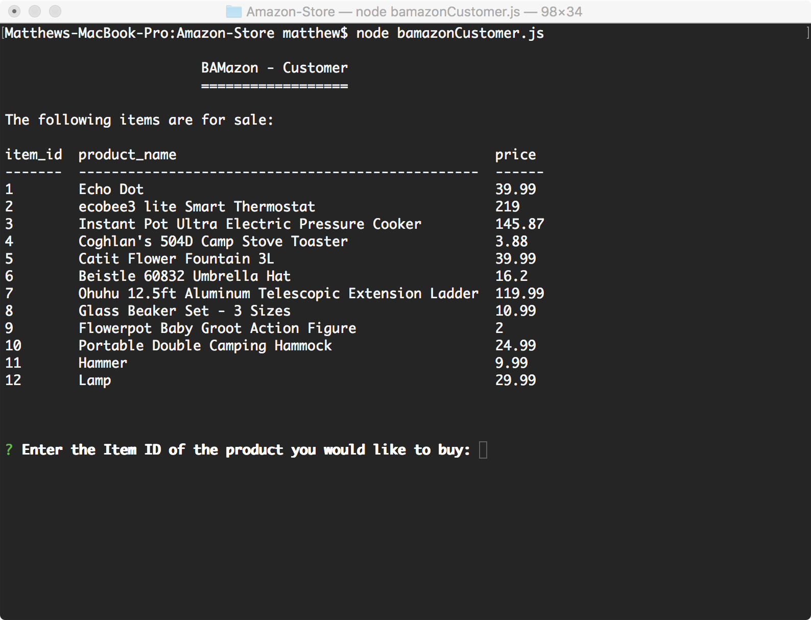
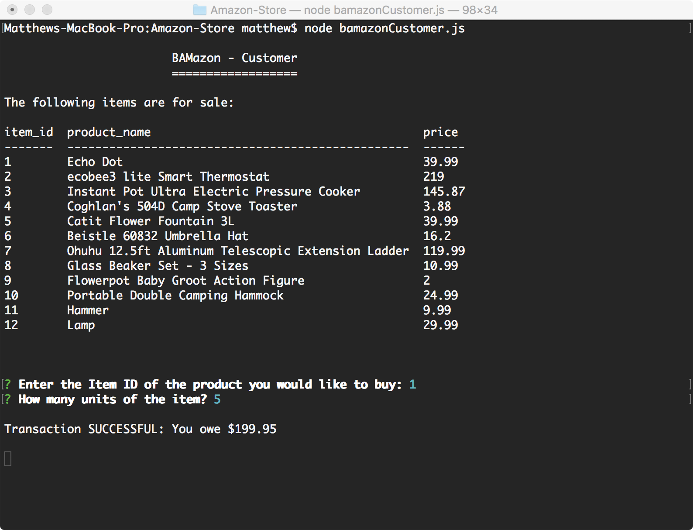
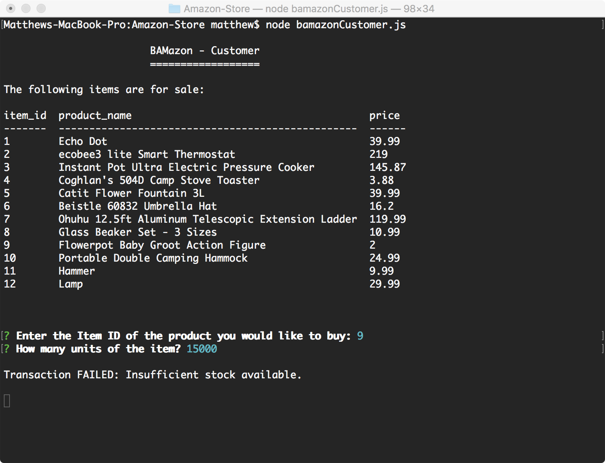
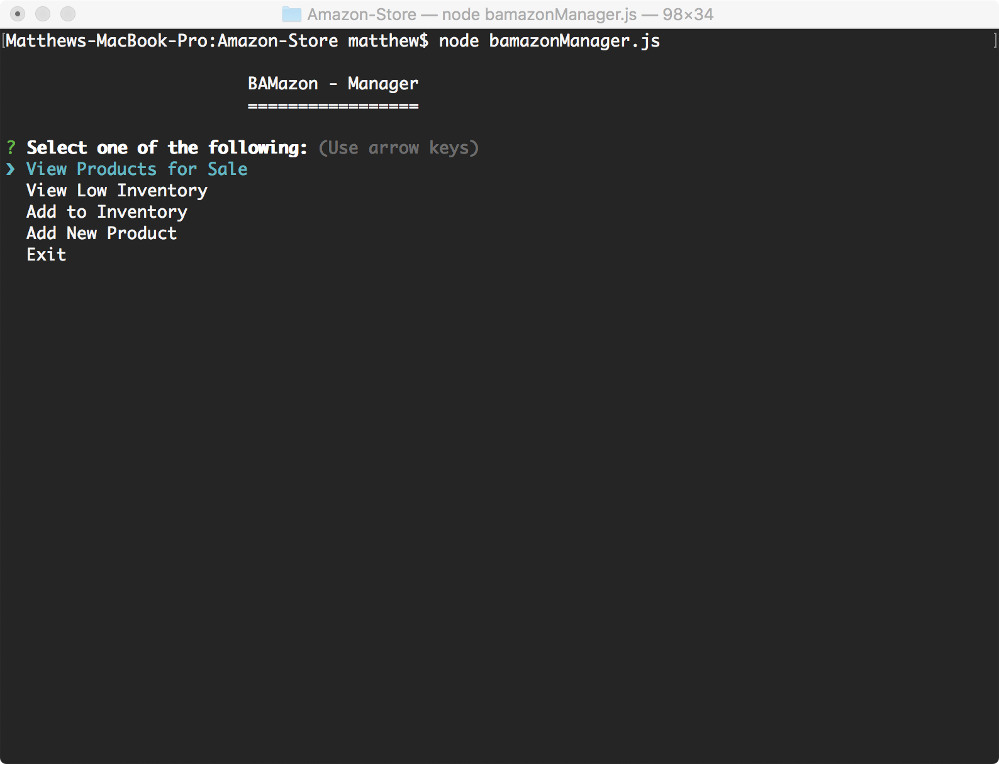
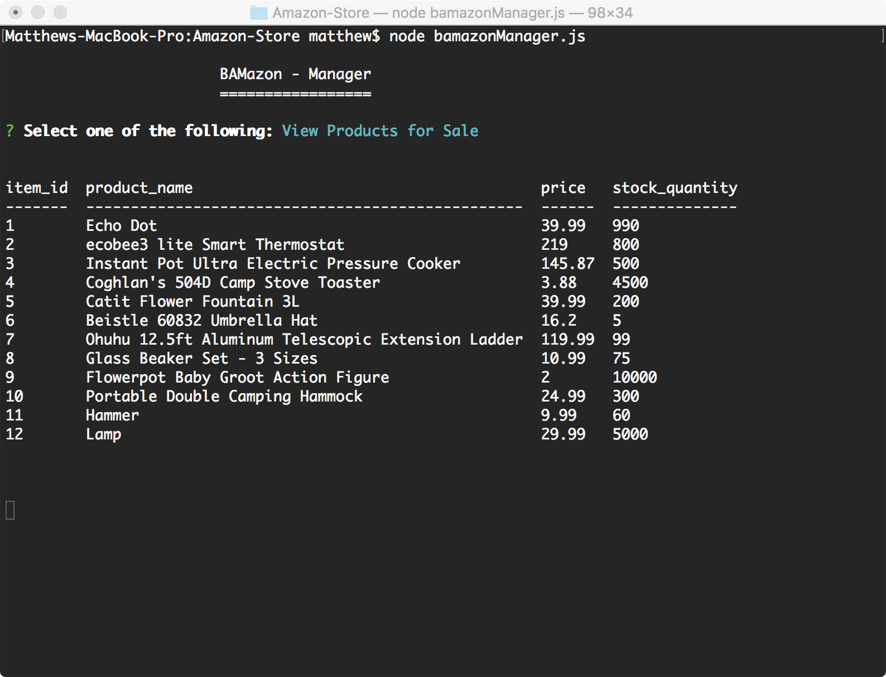
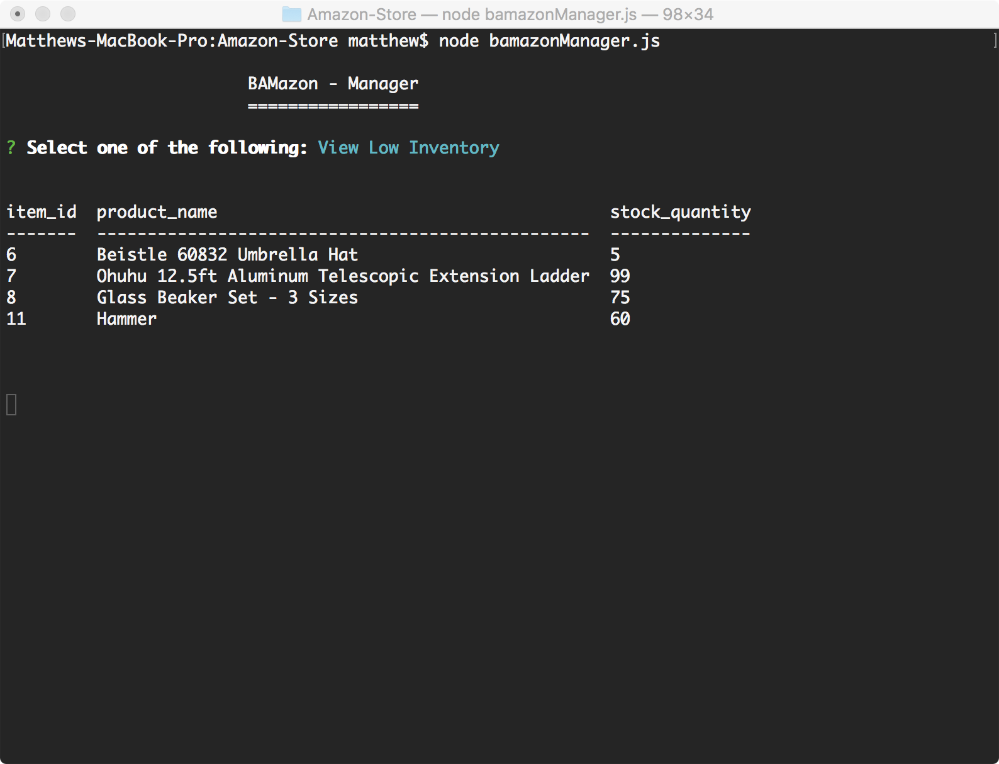
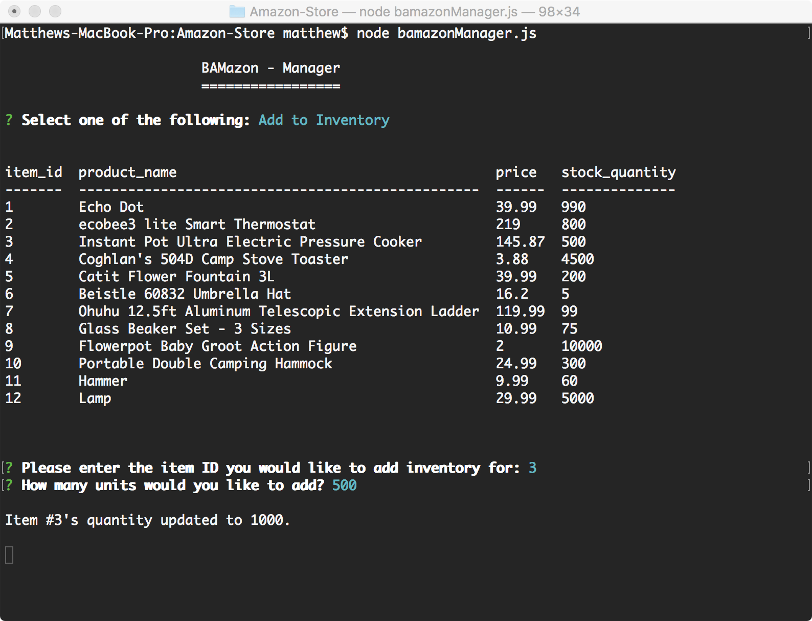
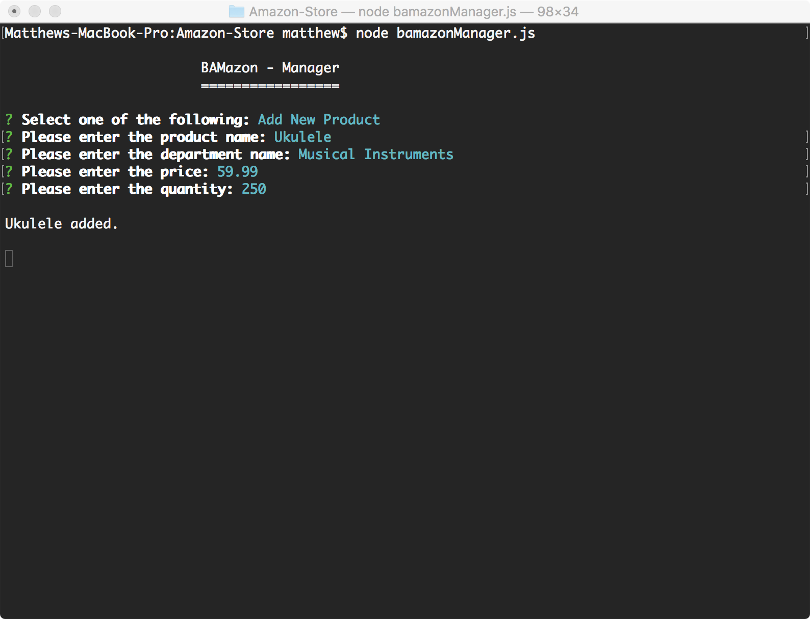
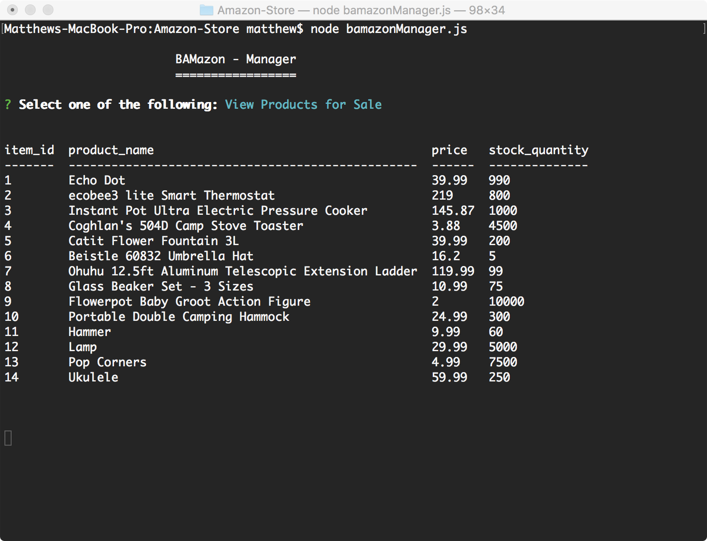

# BAMazon
An Amazon-like storefront to simulate inventory control with MySQL and Node.  There is a Customer and Manager interface.  A MySQL database will have to first be created before running this application.  Screenshots are included to show how the app performs when connected to the database.

## BAMazon - Customer
Allows the user to select an item and purchase a specified quantity.  If there is sufficient quantity in the database, the transaction is successful.  If there is insufficient quantity, the transaction fails.  The quantity in the database is updated after a successful transaction.

**Display All Items**

**Purchase Successful** - *Displays cost afterwards*

**Purchase Failed** - *Insufficient Quantity*

## BAMazon - Manager
Allows the user to perform the following inventory control tasks: View All Products, View Low Inventory, Add to Inventory, and Add New Product.

**Main Menu**

**View All Products**

**View Low Inventory** - *Displays items with a quantity less than 100*

**Add to Inventory**

**Add New Product**

**Updated Table** - *New products added and quantity updated*
